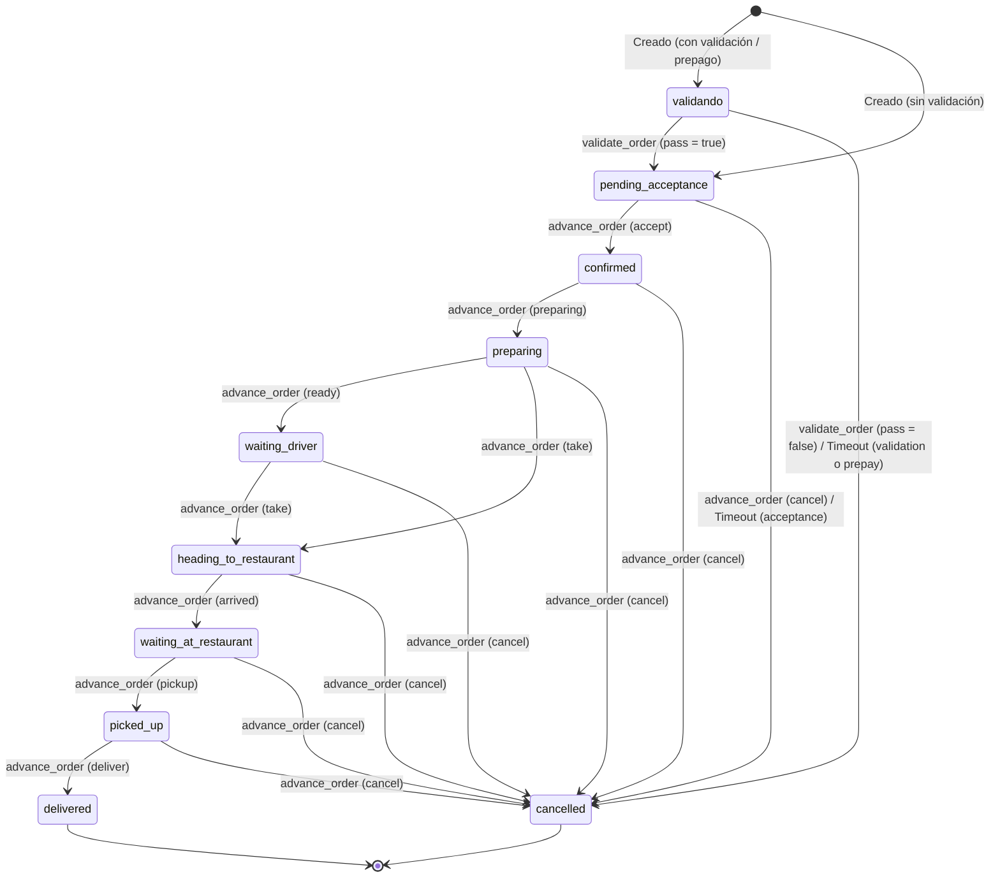

# Auditoría: Estado actual del flujo de pedidos B2C

Este documento recopila las respuestas detalladas sobre la lógica operativa del flujo de pedidos B2C en Tindivo 2.0, fundamentadas estrictamente en el código activo del repositorio.

---

## 1. Timeout de confirmación

### Pregunta
¿Existe algún job, cron, o función de Inngest que cancele automáticamente pedidos que el restaurante no confirma después de X minutos? Si existe, ¿cuántos minutos espera y a qué estado pasa el pedido?

### Evidencia en el Código
* **Función de Inngest**: [orderAcceptanceTimeout](file:///d:/Tinkuy%20Creativo/Proyectos/Tindivo/Code/tindivo-v2/apps/api/lib/inngest/functions.ts#L27-L56)
* **RPC en Postgres**: [expire_order](file:///d:/Tinkuy%20Creativo/Proyectos/Tindivo/Code/tindivo-v2/supabase/migrations/0023_expire_order_prepay_guard.sql#L8-L42)

### Comportamiento
* **Sí existe**: El flujo se orquesta mediante la función Inngest `orderAcceptanceTimeout` (disparada al detectar el evento `EVENT_ORDER_CREATED`).
* **Minutos de espera**: Espera por defecto **5 minutos** (leído dinámicamente desde `app_settings` bajo la clave `timers.acceptanceMinutes`, [functions.ts:L40](file:///d:/Tinkuy%20Creativo/Proyectos/Tindivo/Code/tindivo-v2/apps/api/lib/inngest/functions.ts#L40)).
* **Transición de Estado**: Llama a la función Postgres `expire_order` con la razón `'pending_acceptance_timeout'`. Si el pedido aún está en `'pending_acceptance'`, transiciona su estado a **`'cancelled'`** y establece `cancel_reason = 'pending_acceptance_timeout'` ([0023_expire_order_prepay_guard.sql:L31](file:///d:/Tinkuy%20Creativo/Proyectos/Tindivo/Code/tindivo-v2/supabase/migrations/0023_expire_order_prepay_guard.sql#L31)).

---

## 2. Cancelación del cliente

### Pregunta
¿El cliente puede cancelar un pedido desde la app customer? Si sí, ¿en qué estados del pedido se permite cancelar y en cuáles se bloquea? ¿Hay un botón en la UI y un endpoint en la API, o solo uno de los dos?

### Evidencia en el Código
* **Página del Cliente**: [pedido/[shortId]/page.tsx](file:///d:/Tinkuy%20Creativo/Proyectos/Tindivo/Code/tindivo-v2/apps/customer/app/pedido/%5BshortId%5D/page.tsx)
  * Cálculo de si es cancelable: [page.tsx:L246-L249](file:///d:/Tinkuy%20Creativo/Proyectos/Tindivo/Code/tindivo-v2/apps/customer/app/pedido/%5BshortId%5D/page.tsx#L246-L249)
  * Botón en UI: [page.tsx:L440](file:///d:/Tinkuy%20Creativo/Proyectos/Tindivo/Code/tindivo-v2/apps/customer/app/pedido/%5BshortId%5D/page.tsx#L440)
* **Ruta API**: [cancel/route.ts](file:///d:/Tinkuy%20Creativo/Proyectos/Tindivo/Code/tindivo-v2/apps/api/app/api/v1/customer/orders/%5Bid%5D/cancel/route.ts#L19-L41)
* **RPC en Postgres**: [cancel_customer_order](file:///d:/Tinkuy%20Creativo/Proyectos/Tindivo/Code/tindivo-v2/supabase/migrations/0046_prepaid_no_customer_cancel.sql#L10-L48)

### Comportamiento
* **Sí, el cliente puede cancelar**:
* **Estados en los que se permite**: Únicamente cuando el estado del pedido es **`'validando'`** o **`'pending_acceptance'`** ([0046_prepaid_no_customer_cancel.sql:L25](file:///d:/Tinkuy%20Creativo/Proyectos/Tindivo/Code/tindivo-v2/supabase/migrations/0046_prepaid_no_customer_cancel.sql#L25)).
* **Estados en los que se bloquea**:
  * Cualquier estado operativo posterior (ej. `'confirmed'`, `'preparing'`, `'delivering'`, etc.).
  * Si el método de pago es **prepago** (`payment_intent === 'prepaid'`), la autocancelación está bloqueada tanto en la interfaz como en base de datos ([0046_prepaid_no_customer_cancel.sql:L29](file:///d:/Tinkuy%20Creativo/Proyectos/Tindivo/Code/tindivo-v2/supabase/migrations/0046_prepaid_no_customer_cancel.sql#L29)).
* **Canales**: Existen **ambos**. Hay un botón interactivo en la UI del cliente y un endpoint `POST /customer/orders/[id]/cancel` en el backend que ejecuta el RPC `cancel_customer_order` de forma segura bajo bloqueos transaccionales `FOR UPDATE`.

---

## 3. Métodos de pago en checkout

### Pregunta
En el checkout (`apps/customer/app/checkout/page.tsx`), ¿cómo se renderizan los métodos de pago? ¿Se muestran todos siempre (efectivo, Yape/Plin, prepago), o hay alguna lógica que oculte alguno según el perfil del usuario o el monto?

### Evidencia en el Código
* **Cálculo de Restricciones**: [checkout/page.tsx:L111-L112](file:///d:/Tinkuy%20Creativo/Proyectos/Tindivo/Code/tindivo-v2/apps/customer/app/checkout/page.tsx#L111-L112)
* **Efecto de Sincronización**: [checkout/page.tsx:L227-L228](file:///d:/Tinkuy%20Creativo/Proyectos/Tindivo/Code/tindivo-v2/apps/customer/app/checkout/page.tsx#L227-L228)
* **Renderizado y Deshabilitado**: [checkout/page.tsx:L615-L660](file:///d:/Tinkuy%20Creativo/Proyectos/Tindivo/Code/tindivo-v2/apps/customer/app/checkout/page.tsx#L615-L660)

### Comportamiento
* **Se muestran todos siempre**: Los tres botones (`'pending_cash'`, `'pending_yape'` y `'prepaid'`) se renderizan físicamente en la pantalla.
* **Lógica de Deshabilitado (`mustPrepay`)**: Los métodos contraentrega (`'pending_cash'` y `'pending_yape'`) se deshabilitan (`disabled = mustPrepay`) si el pedido requiere obligatoriamente prepago.
* **Condición de `mustPrepay`**: Se activa si:
  1. **Monto alto**: `subtotal >= prepayThreshold` (umbral parametrizado en `app_settings.prepay_threshold`, por defecto S/100).
  2. **Bloqueo por perfil**: Si el perfil cargado del cliente tiene la propiedad `contraentrega_blocked = true`.

---

## 4. Validación de Celular y Pedidos Históricos en Checkout

### Pregunta
¿Se lee `phone_verified_at` o el conteo de pedidos entregados en algún punto del checkout para condicionar opciones de pago?

### Evidencia en el Código
* **Lectura de Verificación en Checkout**: [checkout/page.tsx:L198](file:///d:/Tinkuy%20Creativo/Proyectos/Tindivo/Code/tindivo-v2/apps/customer/app/checkout/page.tsx#L198)
* **Verificación de pedidos históricos en RPC**: [create_customer_order](file:///d:/Tinkuy%20Creativo/Proyectos/Tindivo/Code/tindivo-v2/supabase/migrations/0056_require_verified_phone.sql#L342-L345)

### Comportamiento
* **`phone_verified_at`**:
  * **En el frontend**: Se lee únicamente como un **guardia de navegación**. Si el cliente entra a `/checkout` pero su teléfono no está verificado (`!profile.phone_verified_at`), es redirigido inmediatamente a la página de inicio (`/`). No condiciona individualmente los botones de pago.
  * **En el backend**: El RPC `create_customer_order` arroja una excepción si la cuenta no cuenta con un teléfono verificado.
* **Historial de Pedidos (Conteo)**:
  * **En el frontend**: **No se lee ni se cuenta** la cantidad de pedidos entregados.
  * **En el backend (RPC)**: Para pedidos contraentrega, se evalúa si es un cliente nuevo comprobando si *no existen* pedidos históricos no cancelados asociados a su teléfono ([0056_require_verified_phone.sql:L342-L345](file:///d:/Tinkuy%20Creativo/Proyectos/Tindivo/Code/tindivo-v2/supabase/migrations/0056_require_verified_phone.sql#L342-L345)). Si es un cliente nuevo, se le impone forzadamente el estado inicial `'validando'` (llamada humana por cajera).

---

## 5. Verificación de comprobante Yape/Plin

### Pregunta
Cuando el usuario paga con Yape/Plin y sube la captura de comprobante, ¿qué flujo sigue? ¿El restaurante ve la captura antes de aceptar el pedido? ¿O la captura se sube después de que el restaurante ya aceptó?

### Evidencia en el Código
* **RPC Creación**: [create_customer_order](file:///d:/Tinkuy%20Creativo/Proyectos/Tindivo/Code/tindivo-v2/supabase/migrations/0056_require_verified_phone.sql#L339-L340)
* **Pantalla de Carga**: [checkout/page.tsx:L1048-L1118](file:///d:/Tinkuy%20Creativo/Proyectos/Tindivo/Code/tindivo-v2/apps/customer/app/checkout/page.tsx#L1048-L1118)
* **Endpoint de Subida**: [prepay-proof/route.ts](file:///d:/Tinkuy%20Creativo/Proyectos/Tindivo/Code/tindivo-v2/apps/api/app/api/v1/customer/orders/%5Bid%5D/prepay-proof/route.ts#L39-L42)
* **RPC Validación del Negocio**: [validate_order](file:///d:/Tinkuy%20Creativo/Proyectos/Tindivo/Code/tindivo-v2/supabase/migrations/0034_validate_order_reason_code.sql#L38-L44)

### Flujo Operativo
1. El pedido se crea inicialmente con estado **`'validando'`** si es prepago (`p_payment_intent = 'prepaid'`).
2. El cliente visualiza la pantalla `<Prepay />` en el checkout para subir el archivo de comprobante al bucket `payment-proofs` de Supabase Storage.
3. Al subirlo, se llama a la API REST (`POST /prepay-proof`) para asociar la ruta de la imagen en la fila del pedido.
4. **El restaurante ve la captura antes de aceptar el pedido**: El pedido se mantiene retenido en `'validando'` y el restaurante tiene que aprobar el comprobante (ejecutando `validate_order`).
5. Tras validar con éxito (`p_pass = true`), el estado del pedido avanza a **`'pending_acceptance'`**, punto en el cual el restaurante recién decide si lo acepta formalmente para comenzar la preparación.

---

## 6. Ventana de 10 minutos para auditar prepagos

### Pregunta
¿Existe la ventana de 10 minutos para que el restaurante audite la captura? Si existe, ¿qué pasa si no la audita a tiempo — se cancela el pedido automáticamente?

### Evidencia en el Código
* **Timeout Job**: [orderPrepayTimeout](file:///d:/Tinkuy%20Creativo/Proyectos/Tindivo/Code/tindivo-v2/apps/api/lib/inngest/functions.ts#L133-L161)
* **Inicio del Job**: [orders/route.ts:L179](file:///d:/Tinkuy%20Creativo/Proyectos/Tindivo/Code/tindivo-v2/apps/api/app/api/v1/customer/orders/route.ts#L179)
* **RPC de Expiración**: [expire_order](file:///d:/Tinkuy%20Creativo/Proyectos/Tindivo/Code/tindivo-v2/supabase/migrations/0023_expire_order_prepay_guard.sql#L23-L32)

### Comportamiento
* **Sí existe**: Es una ventana total controlada por el job `orderPrepayTimeout` de Inngest.
* **Inicio del Tiempo**: Los **10 minutos** comienzan a correr en el mismo instante en que se **crea el pedido** (`orders/route.ts:L179`), y cubre de forma conjunta tanto el tiempo que le toma al cliente subir el comprobante como el tiempo que tarda la cajera en revisarlo.
* **Si expira**: El job invoca la función Postgres `expire_order` con la razón `'prepay_timeout'`. Si el pedido sigue en estado `'validando'`, se cambia su estado a **`'cancelled'`** de manera automática.

---

## 7. Flujo de estados (Máquina de Estados)

### Evidencia en el Código
* **Definición del Enum**: [0001_extensions_and_enums.sql:L19-L30](file:///d:/Tinkuy%20Creativo/Proyectos/Tindivo/Code/tindivo-v2/supabase/migrations/0001_extensions_and_enums.sql#L19-L30)
* **Orquestador Principal**: [advance_order](file:///d:/Tinkuy%20Creativo/Proyectos/Tindivo/Code/tindivo-v2/supabase/migrations/0012_advance_order_rpc.sql#L43-L84)
* **Orquestador de Validación**: [validate_order](file:///d:/Tinkuy%20Creativo/Proyectos/Tindivo/Code/tindivo-v2/supabase/migrations/0034_validate_order_reason_code.sql#L28-L70)

### Estados Posibles
La columna `orders.status` toma uno de los siguientes 10 valores:
1. `'validando'`
2. `'pending_acceptance'`
3. `'confirmed'`
4. `'preparing'`
5. `'waiting_driver'`
6. `'heading_to_restaurant'`
7. `'waiting_at_restaurant'`
8. `'picked_up'`
9. `'delivered'`
10. `'cancelled'`

### Transiciones Válidas (Máquina de Estados)

---

## 8. Notificaciones de Pedido Nuevo al Restaurante

### Evidencia en el Código
* **Envío de Notificación Web Push**: [orderNotifyBusiness](file:///d:/Tinkuy%20Creativo/Proyectos/Tindivo/Code/tindivo-v2/apps/api/lib/inngest/functions.ts#L199-L233)
* **Lógica de Envío VAPID**: [send.ts](file:///d:/Tinkuy%20Creativo/Proyectos/Tindivo/Code/tindivo-v2/apps/api/lib/push/send.ts#L17-L98)
* **Suscripción en Tiempo Real (WebSocket)**: [chrome.tsx:L730-L741](file:///d:/Tinkuy%20Creativo/Proyectos/Tindivo/Code/tindivo-v2/apps/negocios/components/dashboard/chrome.tsx#L730-L741)
* **Alertas Sonoras y Anuncio de Voz**: [use-audio-alert.ts](file:///d:/Tinkuy%20Creativo/Proyectos/Tindivo/Code/tindivo-v2/apps/negocios/lib/use-audio-alert.ts#L56-L94)

### Comportamiento
Cuando llega un pedido nuevo, el sistema ejecuta dos flujos de notificación independientes:

1. **Si el restaurante tiene la app abierta (Primer Plano)**:
   * **WebSocket (Supabase Realtime)**: Se detecta la inserción en la tabla `orders` mediante la suscripción al canal `biz-orders-${bizId}` ([chrome.tsx:L731](file:///d:/Tinkuy%20Creativo/Proyectos/Tindivo/Code/tindivo-v2/apps/negocios/components/dashboard/chrome.tsx#L731)), lo cual recarga la lista de pedidos en el UI.
   * **Alertas Sonoras y de Voz**: El hook `useDashboardSounds` emite un doble pitido sonoro repetitivo (880Hz + 1175Hz) cada 3 segundos y usa la API del navegador `speechSynthesis` para dictar verbalmente: *"Tienes un pedido nuevo"* ([use-audio-alert.ts:L43](file:///d:/Tinkuy%20Creativo/Proyectos/Tindivo/Code/tindivo-v2/apps/negocios/lib/use-audio-alert.ts#L43)).
2. **Si el restaurante no tiene la app abierta / está en segundo plano / pantalla apagada**:
   * **Web Push (Notificación Nativa)**: El backend activa el job `orderNotifyBusiness` de Inngest, el cual identifica al operador de la tienda y dispara una notificación **Web Push** real en segundo plano utilizando el estándar VAPID ([send.ts:L49](file:///d:/Tinkuy%20Creativo/Proyectos/Tindivo/Code/tindivo-v2/apps/api/lib/push/send.ts#L49)). Esto hace que el navegador del dispositivo del operador (computadora o celular) despierte y muestre el banner nativo de notificación, incluso si la pestaña está totalmente cerrada.
